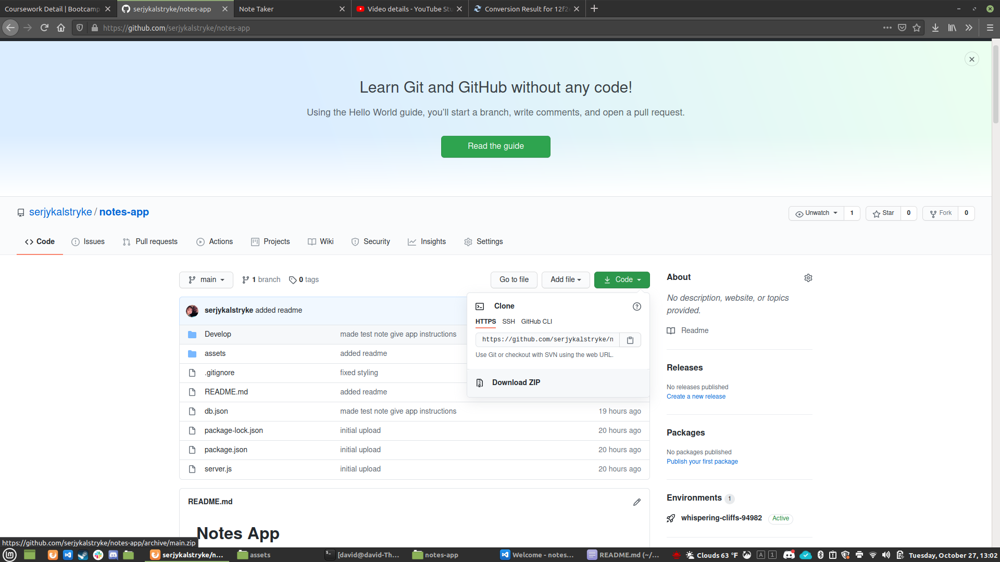
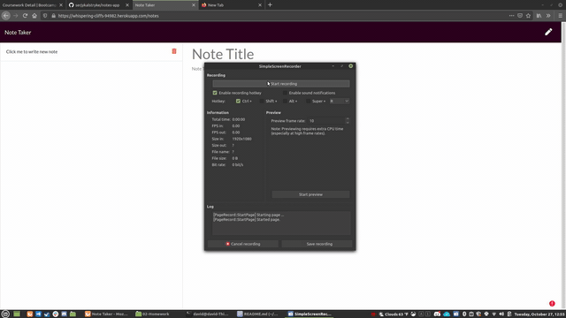
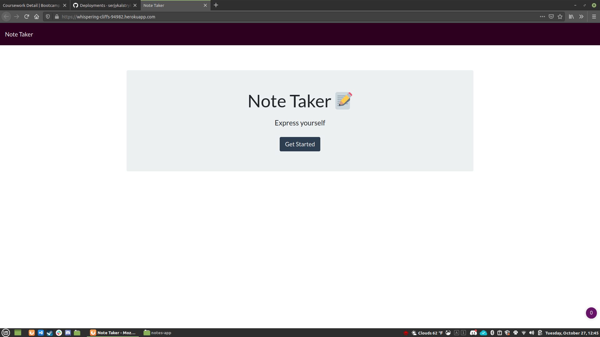
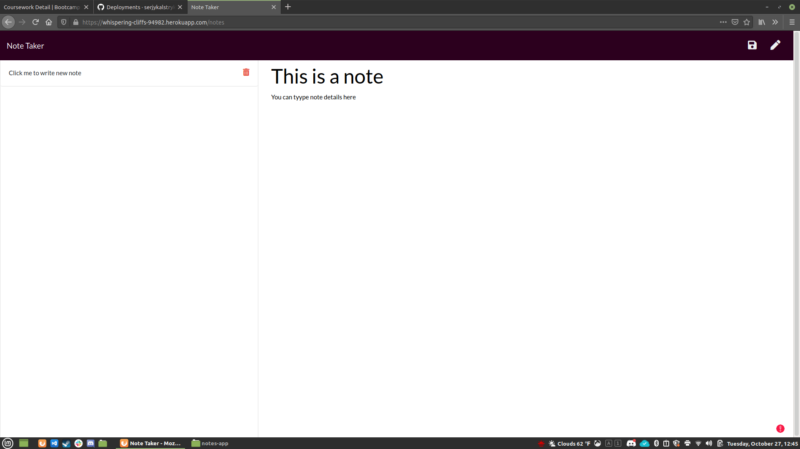
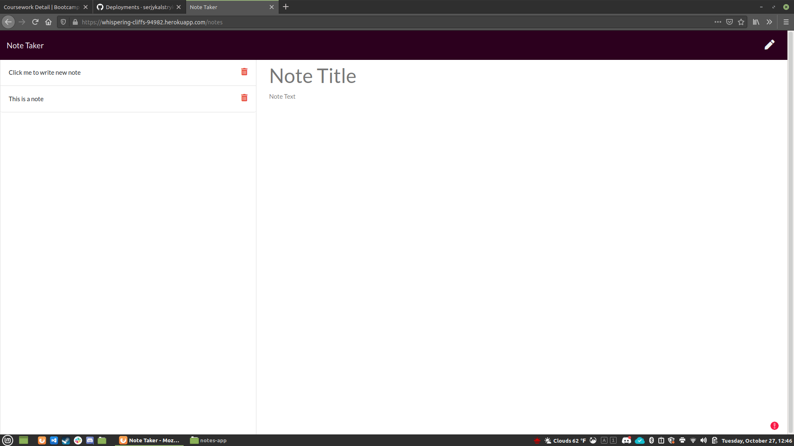
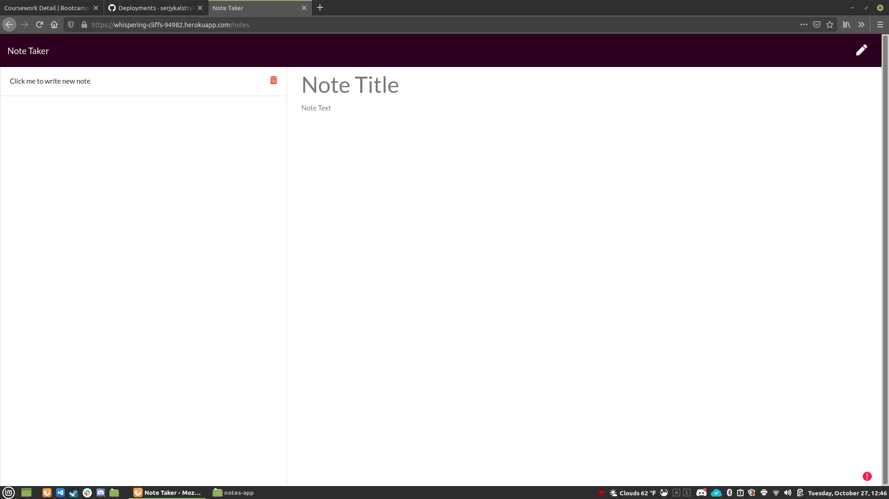

# **Notes App**

## Description 
This is a simple note taking application. You can enter a note titles and and details and then use the save icon to save your note.
## Table of contents
- [Description](#Description)
- [Installation](#Installation)
- [Usage](#Usage)
- [Licence](#Licence)
- [Contributors](#Contributors)
- [Test](#Test)
- [Repository Link](#Repository)
- [Submit Questions to:](#GitHub) 
## Installation
you can clone the repository on github if you wish to run it locally, or you can go to the heroku deployment at https://whispering-cliffs-94982.herokuapp.com/notes 

[

## Usage
Simply type the title and details for the not you wish to add then click the save icon. If you wish to add a new note you can either click the pencil icon or the "Click here to add new note" section at the top of the notes list

](https://youtu.be/bZuev_pO32A "Everything Is AWESOME")

## Licence
GNU AGPLv3
## Contributors
David Stinnett
## Test
visit the heroku deployment and try out the application, feel free to contact me if you have any issues
## Repository
- [Project Repo](https://github.com/serjykalstryke/notes-app)

## Sample of application in action

## Questions? Contact me here:

- David Stinnett
- [GitHub Profile](https://github.com/serjykalstryke)
- <davidstinnett@icloud.com>
